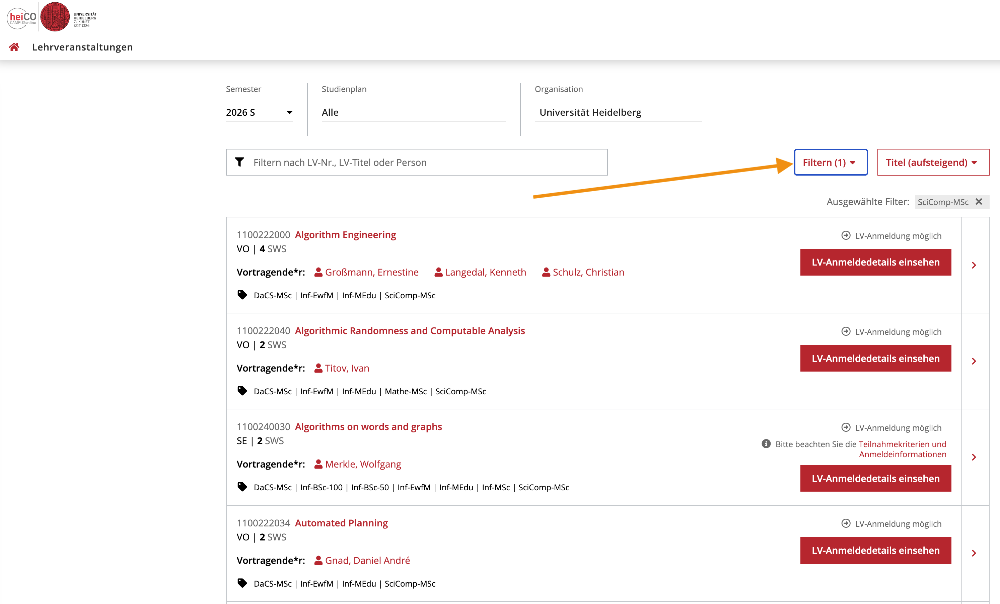
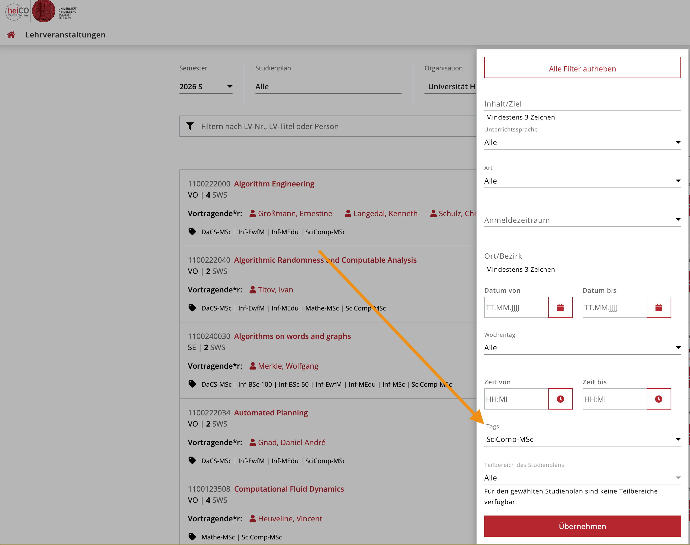

# 🎓 Scientific Computing @ Heidelberg — Student Course Guide

> **Maintained by students, for students.**  
> This is an unofficial, community-maintained resource for the M.Sc. Scientific Computing program at Heidelberg University. Information here supplements (and does not replace) official program documentation.

---

## 📌 Quick Navigation

| I want to... | Go to |
|---|---|
| Browse approved courses | [📋 Course List](courses/course-list.md) |
| Find answers to common questions | [❓ Coordinator Q&A](faq/coordinator-qa.md) |
| Read archived emails to Dr. Winckler | [📧 Email Archive](emails/) |
| Report outdated info / ask a question | [Open an Issue](../../issues/new/choose) |
| Contribute to this repo | [CONTRIBUTING.md](CONTRIBUTING.md) |

---

## 🗺️ Program Structure (Quick Reference)

The M.Sc. Scientific Computing program consists of courses drawn from three faculties:

- **Faculty of Mathematics and Computer Science** — Core modules and BSc imports
- **Faculty of Physics and Astronomy** — Application Area: Physics
- **IWR / Interdisciplinary Center for Scientific Computing** — Simulation methods

[Module Handbook (updated on 2022.02.09)](https://backend.uni-heidelberg.de/en/documents/modulhandbuch-scientific-computing-ma-2022-02-09/download)

[Examination Rules and Regulations (DE) (updated on 2022.10.05)](https://backend.uni-heidelberg.de/de/dokumente/pruefungsordnung-scientific-computing-ma-2022-10-05/download)

---

## ⚠️ Disclaimer

This repository is **not officially affiliated** with Heidelberg University or the Scientific Computing program coordination. Always verify critical information (credit counts, registration deadlines, validity) with the official coordinator:

**Dr. M. Winckler** — Program Coordinator, Scientific Computing  
Contact via the [IWR website](https://www.iwr.uni-heidelberg.de)

---

## 🤝 How to Contribute

See [CONTRIBUTING.md](CONTRIBUTING.md) for full guidelines. In short:

1. **Spotted outdated info?** → Open an Issue using the *Course Update* template
2. **Have a Q&A with Winckler to share?** → Open a PR to add it to [faq/coordinator-qa.md](faq/coordinator-qa.md)
3. **Want to add an anonymized email?** → Follow the guidelines in [emails/README.md](emails/README.md)

---

## 📅 Changelog

| Date | Change | Contributor |
|---|---|---|
| 2025-04 | Initial course list created from program spreadsheet | [ChengYuChuan](https://github.com/ChengYuChuan) |

---

## Using tag in Heico for filtering courses in Scientific Computing

### Step 1

### Step 2
